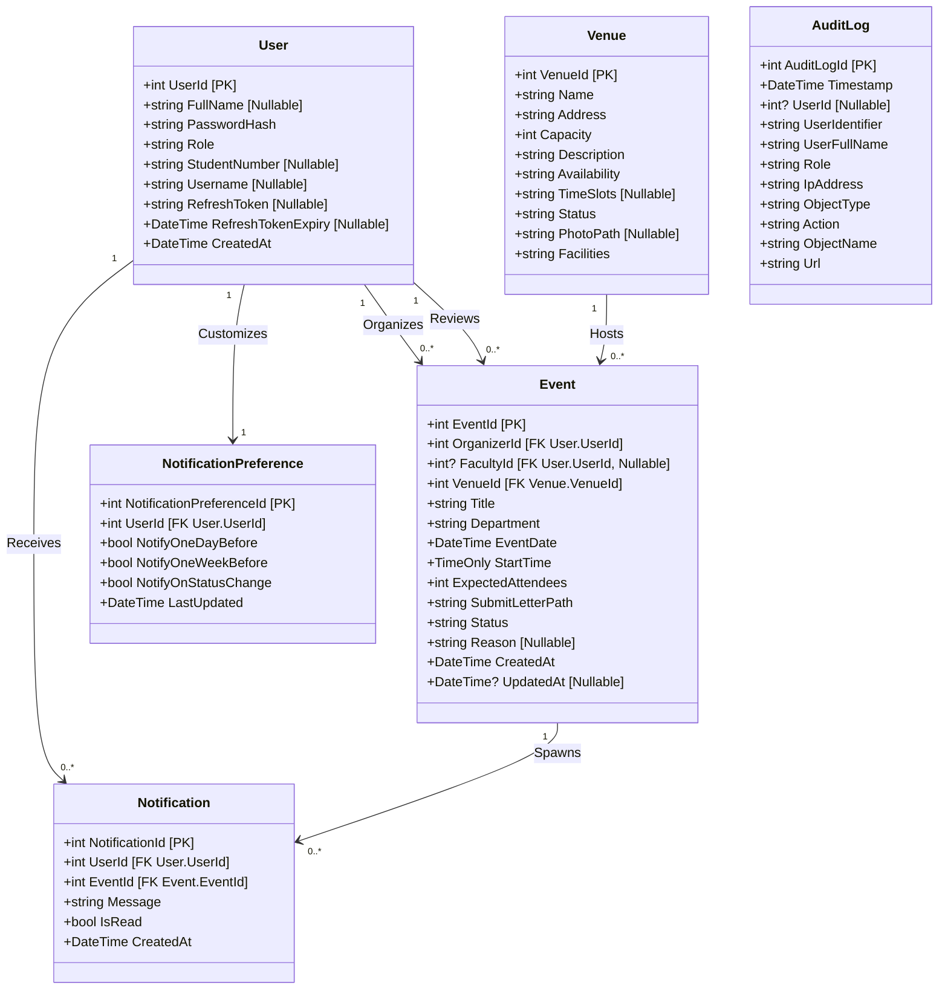
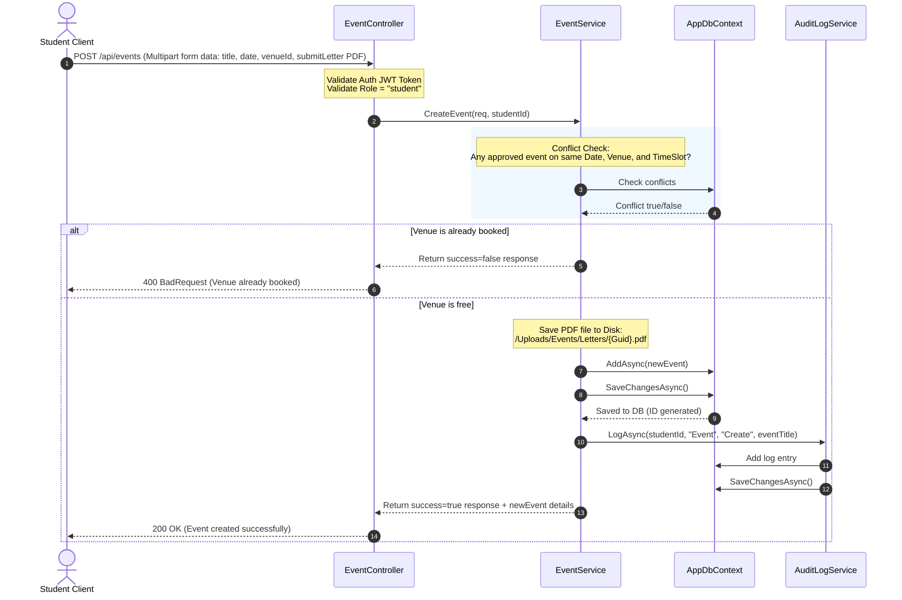
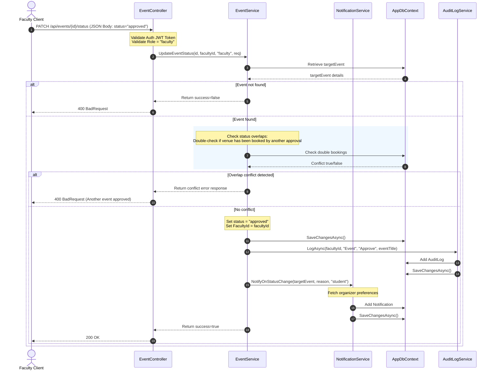
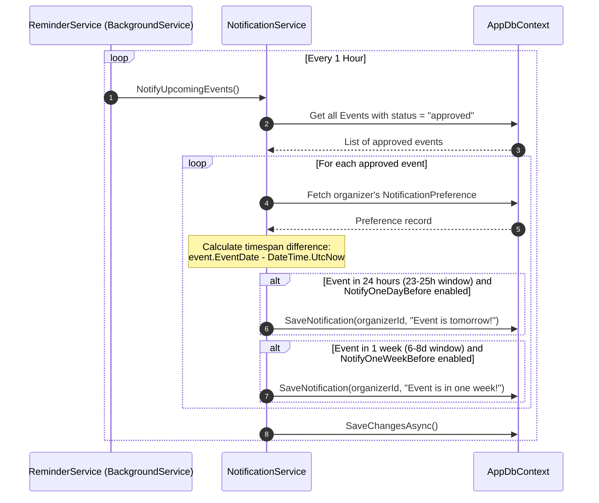

# EventSync System Design Document

This document serves as the official system architecture and design reference for **EventSync**, a comprehensive platform for student event application, venue management, and scheduling coordination. 

---

## 1. System Overview

EventSync is built on a decoupled, modern client-server architecture consisting of:
- **Frontend Client:** A Single Page Application (SPA) style interface built using semantic HTML5, vanilla CSS3, and modern JavaScript (ES6+). It communicates asynchronously with the backend server via HTTP fetch calls and utilizes local/session storage for state persistence.
- **Backend API:** An ASP.NET Core Web API built on .NET 8, implementing the Controller-Service-Repository pattern.
- **ORM / Database Layer:** Entity Framework Core (EF Core) acting as the object-relational mapper, communicating with a remote MySQL database hosted via Aiven.
- **Authentication & Security:** JWT (JSON Web Tokens) with asymmetric/symmetric security parameters for stateless authentication, combined with ASP.NET Core Role-Based Access Control (RBAC) and cryptographically secured password hashing using identity services.

---

## 2. Architecture Diagrams (UML)

### Backend Service Dependency & Layer Architecture
The diagram below illustrates the Layered Dependency Injection (DI) architecture, tracing client requests from Controllers to Services, down to Entity Framework Core's Database Context.

```mermaid
classDiagram
    direction TB
    class AppDbContext {
        +DbSet~User~ Users
        +DbSet~Event~ Events
        +DbSet~Venue~ Venues
        +DbSet~Notification~ Notifications
        +DbSet~NotificationPreference~ NotificationPreferences
        +DbSet~AuditLog~ AuditLogs
    }
    
    class AuditLogService {
        -_context AppDbContext
        -_httpContextAccessor IHttpContextAccessor
        +LogAsync(userId, userIdentifier, userFullName, role, objectType, action, objectName) Task
    }
    
    class AuthService {
        -_context AppDbContext
        -_hasher IPasswordHasher~User~
        -_jwtGenerator JwtGenerator
        -_auditLogService AuditLogService
        +Register(AuthRegisterRequest) GlobalResponse
        +Login(AuthLoginRequest) GlobalResponse
        +Refresh(AuthRefreshRequest, userId) GlobalResponse
        +Logout(userId) GlobalResponse
    }

    class EventService {
        -_dbContext AppDbContext
        -_notificationService NotificationService
        -_auditLogService AuditLogService
        +GetEvents(id, role, status) GlobalResponse
        +CreateEvent(EventCreateRequest, studentId) GlobalResponse
        +UpdateEventStatus(eventId, userId, userRole, EventStatusUpdateRequest) GlobalResponse
    }

    class VenueService {
        -_context AppDbContext
        -_auditLogService AuditLogService
        +GetVenues(status) GlobalResponse
        +AddVenue(VenueCreateDto) GlobalResponse
        +DeleteVenue(venueId) GlobalResponse
    }

    class NotificationService {
        -_context AppDbContext
        -_auditLogService AuditLogService
        -SaveNotification(userId, eventId, message) Task
        +NotifyOnStatusChange(Event, reason, role) Task
        +NotifyUpcomingEvents() Task
        +GetAll(userId) GlobalResponse
        +MarkAsRead(id) GlobalResponse
        +MarkAllAsRead(userId) GlobalResponse
        +GetPreference(userId) GlobalResponse
        +UpdatePreference(userId, NotificationUpdatePreferenceDto) GlobalResponse
    }

    class ReminderService {
        -_serviceProvider IServiceProvider
        #ExecuteAsync(CancellationToken) Task
    }

    class DashboardService {
        -_context AppDbContext
        +Get(userId, userRole) GlobalResponse
    }

    class AuthController {
        -_authService AuthService
        +Register(req) Task~ActionResult~
        +Login(req) Task~ActionResult~
        +Refresh(req) Task~IActionResult~
        +Logout() Task~ActionResult~
    }

    class EventController {
        -_eventService EventService
        +GetEvents(status) Task~ActionResult~
        +Create(req) Task~ActionResult~
        +UpdateStatus(id, req) Task~ActionResult~
    }

    class VenueController {
        -_venueService VenueService
        +GetVenues(status) Task~IActionResult~
        +AddVenue(req) Task~IActionResult~
        +DeleteVenue(id) Task~IActionResult~
    }

    class NotificationController {
        -_notificationService NotificationService
        +GetAll() Task~IActionResult~
        +MarkAsRead(id) Task~IActionResult~
        +MarkAllAsRead() Task~IActionResult~
        +GetPreference() Task~IActionResult~
        +UpdatePreferences(preference) Task~IActionResult~
    }

    class AuditLogController {
        -_context AppDbContext
        +GetAll() Task~IActionResult~
    }

    class DashboardController {
        -_dashboardService DashboardService
        +Get() Task~IActionResult~
    }

    %% Relationships
    AuthController --> AuthService
    EventController --> EventService
    VenueController --> VenueService
    NotificationController --> NotificationService
    DashboardController --> DashboardService
    AuditLogController --> AppDbContext
    
    AuthService --> AppDbContext
    AuthService --> AuditLogService
    EventService --> AppDbContext
    EventService --> NotificationService
    EventService --> AuditLogService
    VenueService --> AppDbContext
    VenueService --> AuditLogService
    NotificationService --> AppDbContext
    NotificationService --> AuditLogService
    DashboardService --> AppDbContext
    ReminderService --> NotificationService : Resolves via Scope
    AuditLogService --> AppDbContext
```

### Domain Data Model Diagram
This model depicts data entities, their data fields, data types, and primary-foreign key relationships mapped by Entity Framework Core.

---

## 3. Database Schema Design

Based on Entity Framework configurations in [AppDbContext.cs](file:///c:/Users/roger/Desktop/Test/EventSync/backend/Data/AppDbContext.cs), the MySQL relational database contains the following schemas:

### `Users` Table
Holds core data for all registrants (Students and Faculty). Roles differentiate access permissions.
- `UserId` (INT, Primary Key, Auto-Increment)
- `FullName` (VARCHAR, Nullable)
- `PasswordHash` (VARCHAR, Not Null)
- `Role` (VARCHAR, Not Null): E.g., `"student"` or `"faculty"`.
- `StudentNumber` (VARCHAR(10), Nullable, Unique constraint enforced in service layer for students)
- `Username` (VARCHAR, Nullable, Unique constraint enforced in service layer for faculty)
- `RefreshToken` (VARCHAR, Nullable)
- `RefreshTokenExpiry` (DATETIME, Nullable)
- `CreatedAt` (DATETIME, Not Null)

### `Venues` Table
Contains physical venue details, capacity, and default configuration metadata.
- `VenueId` (INT, Primary Key, Auto-Increment)
- `Name` (VARCHAR, Not Null)
- `Address` (VARCHAR, Not Null)
- `Capacity` (INT, Not Null)
- `Description` (TEXT, Not Null)
- `Availability` (VARCHAR, Not Null): Days of the week availability.
- `TimeSlots` (VARCHAR, Nullable): Comma-separated list of time slots.
- `Status` (VARCHAR, Not Null): `"available"`, `"not available"`.
- `PhotoPath` (VARCHAR, Nullable): Relative server path to uploaded venue banners.
- `Facilities` (TEXT, Not Null): Comma-separated list of facilities.

### `Events` Table
Saves all student proposed events, statuses, files, and review decisions.
- `EventId` (INT, Primary Key, Auto-Increment)
- `OrganizerId` (INT, Foreign Key referencing `Users.UserId`, Not Null)
- `FacultyId` (INT, Foreign Key referencing `Users.UserId`, Nullable)
- `VenueId` (INT, Foreign Key referencing `Venues.VenueId`, Not Null)
- `Title` (VARCHAR, Not Null)
- `Department` (VARCHAR, Not Null)
- `EventDate` (DATETIME, Not Null)
- `StartTime` (TIME, Not Null)
- `ExpectedAttendees` (INT, Not Null)
- `SubmitLetterPath` (VARCHAR, Not Null): Relative server path to student PDF letter files.
- `Status` (VARCHAR, Not Null): `"pending"`, `"approved"`, `"rejected"`, `"cancelled"`.
- `Reason` (TEXT, Nullable): Explains why a request was rejected or cancelled.
- `CreatedAt` (DATETIME, Not Null)
- `UpdatedAt` (DATETIME, Nullable)

### `Notifications` Table
Tracks push/in-app alert records sent to system users.
- `NotificationId` (INT, Primary Key, Auto-Increment)
- `UserId` (INT, Foreign Key referencing `Users.UserId`, Not Null)
- `EventId` (INT, Foreign Key referencing `Events.EventId`, Not Null)
- `Message` (TEXT, Not Null)
- `IsRead` (TINYINT/BOOLEAN, Not Null, Default `0`)
- `CreatedAt` (DATETIME, Not Null)

### `NotificationPreferences` Table
Details customizable notification constraints for users.
- `NotificationPreferenceId` (INT, Primary Key, Auto-Increment)
- `UserId` (INT, Foreign Key referencing `Users.UserId`, Not Null)
- `NotifyOneDayBefore` (TINYINT/BOOLEAN, Not Null, Default `1`)
- `NotifyOneWeekBefore` (TINYINT/BOOLEAN, Not Null, Default `1`)
- `NotifyOnStatusChange` (TINYINT/BOOLEAN, Not Null, Default `1`)
- `LastUpdated` (DATETIME, Not Null)

### `AuditLogs` Table
Maintains historical, tamper-evident user activity logs for security reviews.
- `AuditLogId` (INT, Primary Key, Auto-Increment)
- `Timestamp` (DATETIME, Not Null)
- `UserId` (INT, Nullable)
- `UserIdentifier` (VARCHAR, Not Null, Default `"Anonymous"`)
- `UserFullName` (VARCHAR, Not Null, Default `"Anonymous"`)
- `Role` (VARCHAR, Not Null, Default `"Anonymous"`)
- `IpAddress` (VARCHAR, Not Null)
- `ObjectType` (VARCHAR, Not Null)
- `Action` (VARCHAR, Not Null)
- `ObjectName` (VARCHAR, Not Null)
- `Url` (VARCHAR, Not Null)

---

## 4. Authentication and Authorization System

The authorization workflow is state-free, relying entirely on cryptographic signing and JWT security tokens.

### JWT Structure & Claims
When login is successful, `AuthService` leverages the `JwtGenerator` to issue an Access Token containing the following Claims:
1. `ClaimTypes.NameIdentifier` &rarr; Contains the user's integer database ID (`UserId`).
2. `ClaimTypes.Name` &rarr; Contains the user's `FullName` or an empty string.
3. `ClaimTypes.Role` &rarr; Defines the role string (`"student"` or `"faculty"`).

### Configurations (from appsettings.Development.json)
- **Token Lifespan:** 60 Minutes (`Jwt:ExpiryMinutes`)
- **Signature Algorithm:** HMAC-SHA256 (`SecurityAlgorithms.HmacSha256`)
- **Key Validation:** Ensures validation of Token Issuer (`ValidateIssuer`), Audience (`ValidateAudience`), Lifetime (`ValidateLifetime`), and Signing Key (`ValidateIssuerSigningKey`).

### Token Refresh & Rotation Flow
1. **Refresh Token Generation:** A cryptographically secure 96-byte string is generated via `RandomNumberGenerator.GetBytes(96)` and saved as a Base64-encoded string.
2. **Persistence:** The token hash is stored directly in the `Users` table (`RefreshToken`) along with a strict expiry date (`RefreshTokenExpiry`) set to 7 days from generation (`DateTime.UtcNow.AddDays(7)`).
3. **Rotation:** Upon hitting the `/api/auth/refresh` endpoint, if the validation checks pass, both a brand-new Access Token and a new Refresh Token are generated (token rotation), invalidating the previous refresh token.

### Role-Based Access Control (RBAC)
Controllers restrict actions using the `[Authorize(Roles = "...")]` attributes:
- `[Authorize(Roles = "student")]`: Grants access only to users with the `"student"` role claim (e.g., submitting event requests).
- `[Authorize(Roles = "faculty")]`: Grants access only to users with the `"faculty"` role claim (e.g., adding/deleting venues, viewing audit logs).
- `[Authorize]`: Restricts endpoints to any authenticated user with a valid JWT token.

---

## 5. API Endpoint Specifications

### Authentication Controller (`api/auth`)
*   `POST api/auth/register`
    *   **Auth Requirement:** `[AllowAnonymous]`
    *   **Request Schema:** `AuthRegisterRequest`
    *   **Response:** `GlobalResponse` containing confirmation messages.
*   `POST api/auth/login`
    *   **Auth Requirement:** `[AllowAnonymous]`
    *   **Request Schema:** `AuthLoginRequest`
    *   **Response:** `GlobalResponse` containing `AuthDataObjectResponse` (user profile data, tokens, expires in value).
*   `POST api/auth/refresh`
    *   **Auth Requirement:** `[Authorize]`
    *   **Request Schema:** `AuthRefreshRequest`
    *   **Response:** `GlobalResponse` containing rotated tokens and expires in value.
*   `POST api/auth/logout`
    *   **Auth Requirement:** `[Authorize]`
    *   **Response:** `GlobalResponse` clearing session state.

### Event Controller (`api/events`)
*   `GET api/events`
    *   **Auth Requirement:** `[Authorize]` (Available to both Students and Faculty)
    *   **Request Query Parameters:** `status` (string, required)
    *   **Response:** `GlobalResponse` with array of matching `Event` models.
        *   *Student Role constraint:* Filters query down to their own organized events.
        *   *Faculty Role constraint:* Filters query down to requests assigned to them, or all pending events. Cannot view cancelled events.
*   `POST api/events`
    *   **Auth Requirement:** `[Authorize(Roles = "student")]`
    *   **Request Format:** `[FromForm] EventCreateRequest` (Multipart Form Data supporting PDF upload)
    *   **Response:** `GlobalResponse` with created `Event` details.
*   `PATCH api/events/{id}/status`
    *   **Auth Requirement:** `[Authorize]`
    *   **Request Schema:** `[FromBody] EventStatusUpdateRequest`
    *   **Response:** `GlobalResponse` detailing update success state.
        *   *Student role capability:* Can cancel their event if current status is `"pending"` or `"approved"`.
        *   *Faculty role capability:* Can change a pending event's status to `"approved"` or `"rejected"`.

### Venue Controller (`api/venues`)
*   `GET api/venues`
    *   **Auth Requirement:** `[Authorize]`
    *   **Request Query Parameters:** `status` (string, optional)
    *   **Response:** `GlobalResponse` containing list of configured venues with lists of timeslots/facilities.
*   `POST api/venues`
    *   **Auth Requirement:** `[Authorize(Roles = "faculty")]`
    *   **Request Format:** `[FromForm] VenueCreateDto` (Multipart Form Data supporting image banner file upload)
    *   **Response:** `GlobalResponse` detailing created `Venue` model.
*   `DELETE api/venues/{id}`
    *   **Auth Requirement:** `[Authorize(Roles = "faculty")]`
    *   **Response:** `GlobalResponse` confirming deletion.
        *   *Constraint:* Prevents deletion if the venue is associated with active events (non-cancelled and non-rejected).

### Notification Controller (`api/notifications`)
*   `GET api/notifications`
    *   **Auth Requirement:** `[Authorize]`
    *   **Response:** `GlobalResponse` with list of notifications ordered by creation timestamp.
*   `POST api/notifications/{notificationId}/read`
    *   **Auth Requirement:** `[Authorize]`
    *   **Response:** `GlobalResponse` marking the specific ID as read.
*   `POST api/notifications/read-all`
    *   **Auth Requirement:** `[Authorize]`
    *   **Response:** `GlobalResponse` marking all notifications for the authenticated user as read.
*   `GET api/notifications/preferences`
    *   **Auth Requirement:** `[Authorize]`
    *   **Response:** `GlobalResponse` with the user's `NotificationPreference` record.
*   `PUT api/notifications/preferences`
    *   **Auth Requirement:** `[Authorize]`
    *   **Request Schema:** `NotificationUpdatePreferenceDto`
    *   **Response:** `GlobalResponse` confirming preference updates.

### Dashboard Controller (`api/dashboard`)
*   `GET api/dashboard`
    *   **Auth Requirement:** `[Authorize]`
    *   **Response:** `GlobalResponse` containing role-specific data:
        *   *Student:* Counts of proposed, pending, available venues, cancelled events, and list of submitted events (`DashboardStudentResponseDto`).
        *   *Faculty:* Counts of active events, pending approvals, available venues today, rejected events, and tracked events (`DashboardFacultyResponseDto`).

### Audit Log Controller (`api/auditlogs`)
*   `GET api/auditlogs`
    *   **Auth Requirement:** `[Authorize(Roles = "faculty")]`
    *   **Response:** `GlobalResponse` returning all system audit log rows sorted chronologically descending.

---

## 6. Key Service Workflows

### Event Application Creation Workflow
This sequence diagram details a student booking a venue and submitting their PDF letter request.

### Event Review and Approval Workflow
This diagram illustrates the sequence of actions when a Faculty member approves a pending event proposal.

### Background Reminders Workflow
An automated, hour-based background worker runs queries against the database, triggering reminders to students when events draw near.

