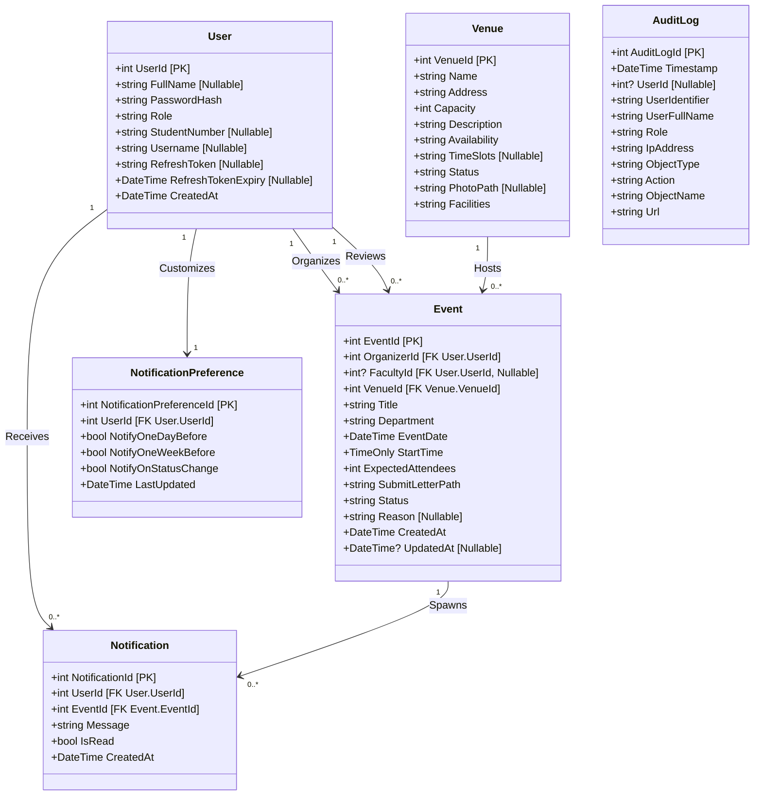
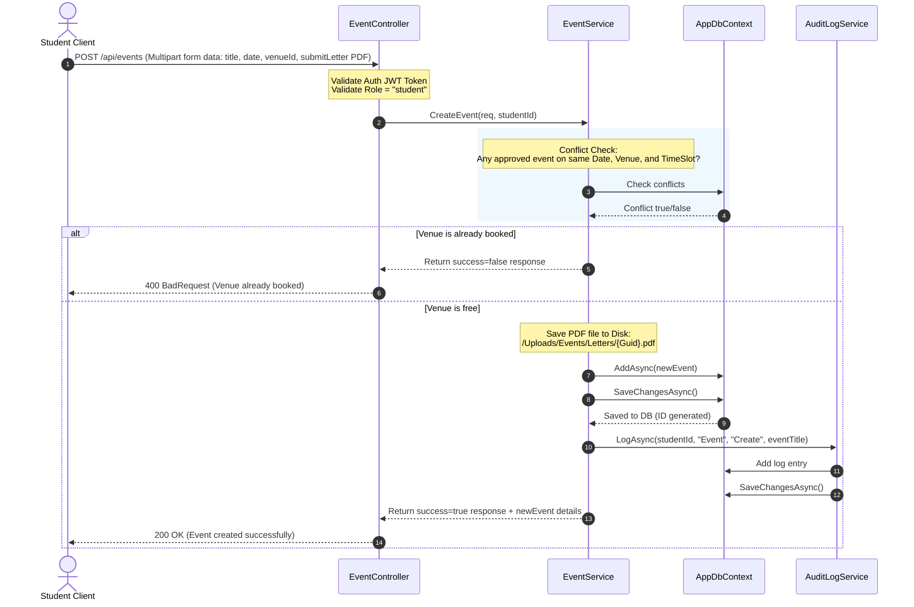
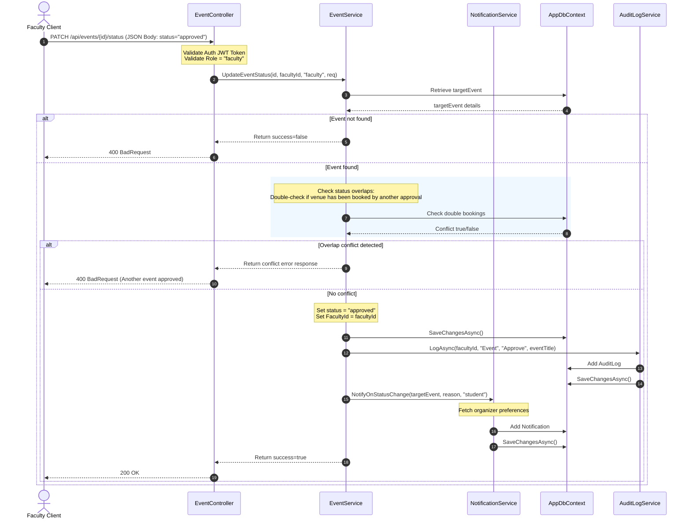
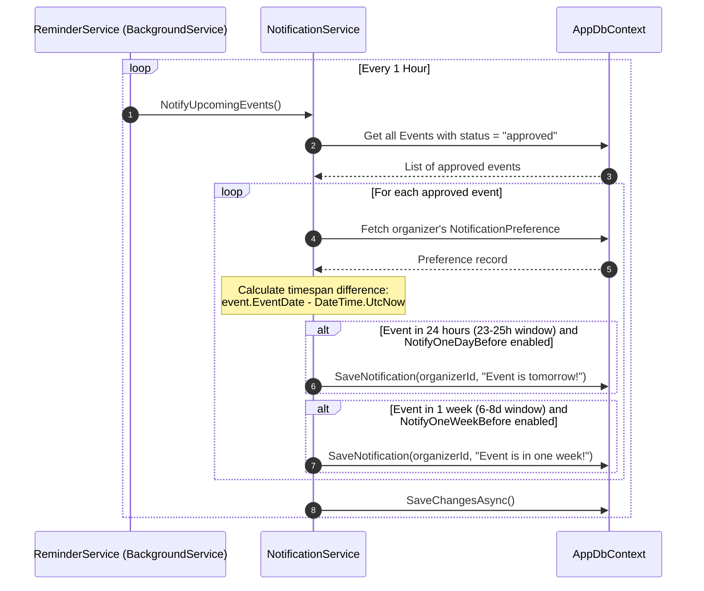

# EventSync — System Design Document


**Version:** 1.0.0
**Backend Stack:** ASP.NET Core Web API (.NET 8), Entity Framework Core, MySQL (Aiven Cloud)
**Document Type:** Technical Reference / Academic Submission


---


## Table of Contents


1. [System Overview](#1-system-overview)
2. [Backend Architecture](#2-backend-architecture)
3. [Authentication & Authorization System](#3-authentication--authorization-system)
4. [Core Modules](#4-core-modules)
   - [4.1 Event System](#41-event-system)
   - [4.2 Venue System](#42-venue-system)
   - [4.3 Notification System](#43-notification-system)
   - [4.4 Dashboard System](#44-dashboard-system)
   - [4.5 Audit Log System](#45-audit-log-system)
5. [API Layer Summary](#5-api-layer-summary)
6. [Database Design Overview](#6-database-design-overview)
7. [Data Flow Explanation](#7-data-flow-explanation)
8. [Error Handling & Validation](#8-error-handling--validation)
9. [File Upload System](#9-file-upload-system)


---


## 1. System Overview


EventSync is built on a decoupled, modern client-server architecture consisting of:
- **Frontend Client:** A Single Page Application (SPA) style interface built using semantic HTML5, vanilla CSS3, and modern JavaScript (ES6+). It communicates asynchronously with the backend server via HTTP fetch calls and utilizes local/session storage for state persistence.
- **Backend API:** An ASP.NET Core Web API built on .NET 8, implementing the Controller-Service-Repository pattern.
- **ORM / Database Layer:** Entity Framework Core (EF Core) acting as the object-relational mapper, communicating with a remote MySQL database hosted via Aiven.
- **Authentication & Security:** JWT (JSON Web Tokens) with asymmetric/symmetric security parameters for stateless authentication, combined with ASP.NET Core Role-Based Access Control (RBAC) and cryptographically secured password hashing using identity services.


---


## 2. Architecture Diagrams (UML)


### Backend Service Dependency & Layer Architecture
The diagram below illustrates the Layered Dependency Injection (DI) architecture, tracing client requests from Controllers to Services, down to Entity Framework Core's Database Context.


### Domain Data Model Diagram
This model depicts data entities, their data fields, data types, and primary-foreign key relationships mapped by Entity Framework Core.





---


## 3. Authentication & Authorization System


### 3.1 JWT Authentication Flow


1. Client sends `POST /api/auth/login` with `studentNumber` or `username` + `password`.
2. `AuthService.Login` looks up the user by identifier.
3. Password is verified using `IPasswordHasher<User>.VerifyHashedPassword`.
4. On success, `JwtGenerator.AccessToken(user)` generates a signed JWT.
5. `JwtGenerator.RefreshToken()` generates a 96-byte cryptographically random refresh token (Base64-encoded).
6. The refresh token and its expiry (`DateTime.UtcNow.AddDays(7)`) are persisted to `Users.RefreshToken` and `Users.RefreshTokenExpiry`.
7. Response returns both tokens inside an `AuthDataObjectResponse`.


### 3.2 Token Generation (`JwtGenerator`)


**Access Token** — `JwtGenerator.AccessToken(user)`


```
Algorithm : HmacSha256
Issuer    : Jwt:Issuer (appsettings)
Audience  : Jwt:Audience (appsettings)
Expiry    : Jwt:ExpiryMinutes from now (60 minutes in development)
```


**Claims embedded in the token:**


| Claim Type                   | Value                  |
|------------------------------|------------------------|
| `ClaimTypes.NameIdentifier`  | `user.UserId.ToString()` |
| `ClaimTypes.Name`            | `user.FullName`        |
| `ClaimTypes.Role`            | `user.Role`            |


**Refresh Token** — `JwtGenerator.RefreshToken()`


- 96 random bytes from `RandomNumberGenerator.GetBytes(96)`, converted to Base64.
- Stored in the `Users` table alongside its expiry (7 days from issuance).


### 3.3 Token Refresh Flow


Endpoint: `POST /api/auth/refresh` — requires a valid (not expired) access token.


1. Controller extracts `userId` from `ClaimTypes.NameIdentifier`.
2. `AuthService.Refresh` fetches the user by ID.
3. Validates that `user.RefreshToken == req.RefreshToken`.
4. Validates that `user.RefreshTokenExpiry > DateTime.UtcNow`.
5. Rotates both tokens: generates new access token and new refresh token.
6. Persists updated refresh token and new 7-day expiry.


### 3.4 Logout


Endpoint: `POST /api/auth/logout` — requires a valid access token.


1. Controller extracts `userId` from the JWT.
2. `AuthService.Logout` sets `user.RefreshToken = null` and `user.RefreshTokenExpiry = null`.
3. The stored refresh token is invalidated server-side.


### 3.5 JWT Validation Parameters (`Program.cs`)


| Parameter                | Value                          |
|--------------------------|--------------------------------|
| `ValidateIssuer`         | `true`                         |
| `ValidateAudience`       | `true`                         |
| `ValidateLifetime`       | `true`                         |
| `ValidateIssuerSigningKey` | `true`                       |
| `ValidIssuer`            | `Jwt:Issuer` (appsettings)     |
| `ValidAudience`          | `Jwt:Audience` (appsettings)   |
| `IssuerSigningKey`       | SymmetricSecurityKey (UTF8 key)|


### 3.6 Role-Based Authorization


Roles are embedded as a claim in the JWT. Two roles exist in the system: `student` and `faculty`.


| Endpoint                     | Authorization Rule                    |
|------------------------------|---------------------------------------|
| `POST /api/events`           | `[Authorize(Roles = "student")]`      |
| `POST /api/venues`           | `[Authorize(Roles = "faculty")]`      |
| `DELETE /api/venues/{id}`    | `[Authorize(Roles = "faculty")]`      |
| `GET /api/auditlogs`         | `[Authorize(Roles = "faculty")]`      |
| All other protected endpoints| `[Authorize]` — any authenticated user|


Role-specific logic within shared endpoints (e.g., `GET /api/events`, `PATCH /api/events/{id}/status`) is enforced inside the service by reading the role from the claim and applying different database queries or return conditions.


---


## 4. Core Modules


### 4.1 Event System


**Service:** `EventService`  
**Controller:** `EventController` (`api/events`)


#### Event Creation Flow


1. Student calls `POST /api/events` with a `multipart/form-data` body (`EventCreateRequest`).
2. `EventService.CreateEvent`:
   a. Checks for venue/date/timeslot conflicts: queries `Events` where `VenueId`, `EventDate.Date`, `StartTime`, and `Status == "approved"` all match. Returns a conflict error if any exist.
   b. Saves the submitted letter file to `Uploads/Events/Letters/<Guid>.<ext>`.
   c. Creates an `Event` record with `Status = "pending"`, `FacultyId = null`, `OrganizerId = studentId`, and `CreatedAt = DateTime.Now`.
   d. Logs the creation via `AuditLogService.LogAsync`.


#### Event Retrieval


`GET /api/events?status={status}` — behavior differs by role:


- **Student:** Returns only events where `OrganizerId == userId` and `Status == status`.
- **Faculty (pending):** Returns all events system-wide with `Status == "pending"`.
- **Faculty (approved/rejected):** Returns events where `FacultyId == userId` and `Status == status`.
- **Faculty (cancelled):** Returns an error — faculty cannot view cancelled events.


Each event record includes the `Organizer` navigation property via `.Include(e => e.Organizer)`.


#### Event Approval/Rejection Flow (Faculty)


1. Faculty calls `PATCH /api/events/{id}/status` with `{ "status": "approved" | "rejected", "reason": "..." }`.
2. `EventService.UpdateEventStatus`:
   a. Validates the event exists and that the target status differs from current.
   b. If approving, re-checks venue/date/timeslot conflicts before committing.
   c. Sets `Status`, `FacultyId = userId`, and `Reason`.
   d. Saves changes.
   e. Logs the approval/rejection via `AuditLogService`.
   f. Calls `NotificationService.NotifyOnStatusChange` to notify the organizer.


#### Event Cancellation Flow (Student)


1. Student calls `PATCH /api/events/{id}/status` with `{ "status": "cancelled", "reason": "..." }`.
2. `EventService.UpdateEventStatus`:
   a. Validates the role is `student` and the target status is `cancelled`.
   b. Allows cancellation only when current status is `pending` or `approved`.
   c. Sets `Status = "cancelled"` and `Reason`.
   d. Saves changes.
   e. Logs the cancellation via `AuditLogService`.
   f. If the event was previously `approved`, calls `NotificationService.NotifyOnStatusChange` to notify the assigned faculty.


#### Business Rules


- An event can only transition: `pending → approved`, `pending → rejected`, `pending → cancelled`, `approved → cancelled`.
- No two approved events can share the same `VenueId`, `EventDate`, and `StartTime`.
- Faculty cannot cancel events; students cannot approve or reject.
- Faculty cannot view cancelled events via `GET /api/events?status=cancelled`.
- Events are created with `Status = "pending"` and `FacultyId = null` by default.


---


### 4.2 Venue System


**Service:** `VenueService`  
**Controller:** `VenueController` (`api/venues`)


#### Venue Retrieval


`GET /api/venues` or `GET /api/venues?status={status}`:
- If `status` query param is `null`: returns all venues.
- If `status` is provided: filters by `Venue.Status`.
- **Timeslot deserialization:** `Venue.TimeSlots` is stored in the database as a comma-separated string (e.g., `"8:00-11:00,13:00-15:00"`). On retrieval, `VenueService.GetVenues` splits this string into a `List<string>` before returning.
- **Facilities deserialization:** `Venue.Facilities` is similarly stored as a comma-separated string and split and trimmed on retrieval.
- Returns 404 (via `NotFound`) if no venues found.


#### Venue Creation (Faculty only)


`POST /api/venues` — `multipart/form-data`, `[Authorize(Roles = "faculty")]`:
1. `VenueService.AddVenue` optionally processes `PhotoCover` (an `IFormFile`).
2. If provided, photo is saved to `Uploads/Venue/Banners/<Guid>.<ext>`.
3. `VenueCreateDto.Timeslots` (a `List<string>`) is joined with commas before being stored in `Venue.TimeSlots`.
4. New venue is created with `Status = "available"`.
5. Logs the creation via `AuditLogService`.


#### Venue Deletion (Faculty only)


`DELETE /api/venues/{id}` — `[Authorize(Roles = "faculty")]`:
1. Checks if the venue exists.
2. **Guard:** Checks if any non-cancelled, non-rejected events exist for this venue. If so, deletion is blocked with an error message.
3. If the venue has a `PhotoPath`, the physical file is deleted from disk.
4. Removes the venue from the database.
5. Logs the deletion via `AuditLogService`.


---


### 4.3 Notification System


**Service:** `NotificationService`  
**Background Service:** `ReminderService`  
**Controller:** `NotificationController` (`api/notifications`)


#### Notification Creation Triggers


Notifications are **never created manually by users**. They are created by the system in two ways:


**1. On Event Status Change (`NotifyOnStatusChange`)**


Called by `EventService.UpdateEventStatus` after a status transition:


- **Faculty approves/rejects → Student notified:**
  - `approved`: `"Your event '{title}' has been approved!"`
  - `rejected` (with reason): `"Your event '{title}' was rejected. Reason: {reason}"`
  - `rejected` (no reason): `"Your event '{title}' was rejected."`
  - Before notifying, checks `NotificationPreference.NotifyOnStatusChange` for the organizer. If `false`, skips.


- **Student cancels an approved event → Faculty notified:**
  - Notifies `event.FacultyId` (only if non-null): `"The event '{title}' by '{organizerId}' was cancelled..."`
  - No preference check is performed for faculty cancellation notifications.


**2. Upcoming Event Reminders (`NotifyUpcomingEvents`)**


Called by `ReminderService` every **1 hour** via a `PeriodicTimer`:


1. Fetches all approved events.
2. For each event, loads the organizer's `NotificationPreference`.
3. If `timeToEvent.TotalHours` is between 23 and 25 and `NotifyOneDayBefore` is `true`: sends a "tomorrow" reminder.
4. If `timeToEvent.TotalDays` is between 6 and 8 and `NotifyOneWeekBefore` is `true`: sends a "one week" reminder.
5. If the organizer has no `NotificationPreference` record at all, they receive no reminders.


#### Notification Management Endpoints


| Action                       | Method | Endpoint                               |
|------------------------------|--------|----------------------------------------|
| Get all notifications        | GET    | `/api/notifications`                   |
| Mark single notification read| POST   | `/api/notifications/{id}/read`         |
| Mark all notifications read  | POST   | `/api/notifications/read-all`          |
| Get preferences              | GET    | `/api/notifications/preferences`       |
| Update preferences           | PUT    | `/api/notifications/preferences`       |


- `GetAll` fetches all `Notification` records where `UserId == userId`, ordered by `CreatedAt DESC`.
- `MarkAsRead` sets `IsRead = true` on a single notification by ID.
- `MarkAllAsRead` sets `IsRead = true` on all unread notifications (`IsRead == false`) for the user.
- `UpdatePreference` overwrites all three preference flags (`NotifyOneDayBefore`, `NotifyOneWeekBefore`, `NotifyOnStatusChange`) and logs the update via `AuditLogService`.


---


### 4.4 Dashboard System


**Service:** `DashboardService`  
**Controller:** `DashboardController` (`api/dashboard`)


Single endpoint: `GET /api/dashboard` — response shape is role-dependent.


> **Important:** `DashboardService.Get` compares `userRole` with the string `"Student"` and `"Faculty"` (capitalized). The JWT claim, however, stores the role exactly as set during registration (e.g., `"student"` lowercase). If there is a case mismatch between what is stored and what the service checks, the dashboard will return `"Invalid user role"`. This is a known behavior derived directly from the code.


#### Student Dashboard (`DashboardStudentResponseDto`)


| Field                | Query                                                      |
|----------------------|------------------------------------------------------------|
| `ProposedEvents`     | COUNT of events where `OrganizerId == userId`              |
| `PendingApproval`    | COUNT of events where `OrganizerId == userId` AND `Status == "pending"` |
| `AvailableVenues`    | COUNT of venues where `Status == "available"`              |
| `CancelledEvents`    | COUNT of events where `OrganizerId == userId` AND `Status == "cancelled"` |
| `MySubmittedEvents`  | All events where `OrganizerId == userId`                   |


#### Faculty Dashboard (`DashboardFacultyResponseDto`)


| Field                 | Query                                                         |
|-----------------------|---------------------------------------------------------------|
| `TotalActiveEvents`   | COUNT of events where `FacultyId == userId` AND `Status == "approved"` |
| `PendingApproval`     | COUNT of all events system-wide where `Status == "pending"`  |
| `AvailableVenuesToday`| COUNT of venues where `Status == "available"`                |
| `RejectedEvents`      | COUNT of events where `FacultyId == userId` AND `Status == "rejected"` |
| `TrackedEvents`       | Events where `Status == "ongoing"`, OR (`FacultyId == userId` AND `Status` is `"approved"` or `"rejected"`) |


---


### 4.5 Audit Log System


**Service:** `AuditLogService`  
**Controller:** `AuditLogController` (`api/auditlogs`)


`AuditLogService.LogAsync` is called by `AuthService`, `EventService`, `VenueService`, and `NotificationService` after every significant action.


#### Log Entry Fields


| Field            | Source                                                                |
|------------------|-----------------------------------------------------------------------|
| `Timestamp`      | `DateTime.UtcNow` at log time                                         |
| `UserId`         | Passed explicitly, or auto-populated from `ClaimTypes.NameIdentifier` |
| `UserIdentifier` | Passed explicitly, or fetched from DB (`Username` for faculty, `StudentNumber` for student) |
| `UserFullName`   | Passed explicitly, or auto-populated from `ClaimTypes.Name`           |
| `Role`           | Passed explicitly, or auto-populated from `ClaimTypes.Role`           |
| `IpAddress`      | `httpContext.Connection.RemoteIpAddress`, defaults to `"127.0.0.1"`   |
| `ObjectType`     | String descriptor of what was acted on (`"Auth"`, `"Event"`, `"Venue"`, `"NotificationPreference"`) |
| `Action`         | String descriptor of what happened (`"Register"`, `"Login"`, `"Create"`, `"Approve"`, etc.) |
| `ObjectName`     | The name or identifier of the affected object                         |
| `Url`            | `httpContext.Request.Path.Value`                                       |


#### Audit Log Retrieval


`GET /api/auditlogs` — accessible only by `[Authorize(Roles = "faculty")]`.


Returns all `AuditLog` records ordered by `Timestamp DESC`, wrapped in a `GlobalResponse`.


#### Startup Data Cleanup


On application startup, `Program.cs` runs a raw SQL query to backfill any `AuditLog` entries where `UserFullName = "Anonymous"` (legacy records) with the actual user's name and identifier from the `Users` table.


---


## 5. API Layer Summary


### Auth Module (`api/auth`)


| Method | Endpoint              | Access       | Request Body              | Response                          |
|--------|-----------------------|--------------|---------------------------|-----------------------------------|
| POST   | `/api/auth/register`  | `[AllowAnonymous]` | `AuthRegisterRequest` | `GlobalResponse`             |
| POST   | `/api/auth/login`     | `[AllowAnonymous]` | `AuthLoginRequest`    | `GlobalResponse` with `AuthDataObjectResponse` |
| POST   | `/api/auth/refresh`   | `[Authorize]`      | `AuthRefreshRequest`  | `GlobalResponse` with `AuthDataObjectResponse` |
| POST   | `/api/auth/logout`    | `[Authorize]`      | _(none)_              | `GlobalResponse`                  |


### Event Controller (`api/events`)
*   `GET api/events`
    *   **Auth Requirement:** `[Authorize]` (Available to both Students and Faculty)
    *   **Request Query Parameters:** `status` (string, required)
    *   **Response:** `GlobalResponse` with array of matching `Event` models.
        *   *Student Role constraint:* Filters query down to their own organized events.
        *   *Faculty Role constraint:* Filters query down to requests assigned to them, or all pending events. Cannot view cancelled events.
*   `POST api/events`
    *   **Auth Requirement:** `[Authorize(Roles = "student")]`
    *   **Request Format:** `[FromForm] EventCreateRequest` (Multipart Form Data supporting PDF upload)
    *   **Response:** `GlobalResponse` with created `Event` details.
*   `PATCH api/events/{id}/status`
    *   **Auth Requirement:** `[Authorize]`
    *   **Request Schema:** `[FromBody] EventStatusUpdateRequest`
    *   **Response:** `GlobalResponse` detailing update success state.
        *   *Student role capability:* Can cancel their event if current status is `"pending"` or `"approved"`.
        *   *Faculty role capability:* Can change a pending event's status to `"approved"` or `"rejected"`.


### Venue Controller (`api/venues`)
*   `GET api/venues`
    *   **Auth Requirement:** `[Authorize]`
    *   **Request Query Parameters:** `status` (string, optional)
    *   **Response:** `GlobalResponse` containing list of configured venues with lists of timeslots/facilities.
*   `POST api/venues`
    *   **Auth Requirement:** `[Authorize(Roles = "faculty")]`
    *   **Request Format:** `[FromForm] VenueCreateDto` (Multipart Form Data supporting image banner file upload)
    *   **Response:** `GlobalResponse` detailing created `Venue` model.
*   `DELETE api/venues/{id}`
    *   **Auth Requirement:** `[Authorize(Roles = "faculty")]`
    *   **Response:** `GlobalResponse` confirming deletion.
        *   *Constraint:* Prevents deletion if the venue is associated with active events (non-cancelled and non-rejected).


### Notification Controller (`api/notifications`)
*   `GET api/notifications`
    *   **Auth Requirement:** `[Authorize]`
    *   **Response:** `GlobalResponse` with list of notifications ordered by creation timestamp.
*   `POST api/notifications/{notificationId}/read`
    *   **Auth Requirement:** `[Authorize]`
    *   **Response:** `GlobalResponse` marking the specific ID as read.
*   `POST api/notifications/read-all`
    *   **Auth Requirement:** `[Authorize]`
    *   **Response:** `GlobalResponse` marking all notifications for the authenticated user as read.
*   `GET api/notifications/preferences`
    *   **Auth Requirement:** `[Authorize]`
    *   **Response:** `GlobalResponse` with the user's `NotificationPreference` record.
*   `PUT api/notifications/preferences`
    *   **Auth Requirement:** `[Authorize]`
    *   **Request Schema:** `NotificationUpdatePreferenceDto`
    *   **Response:** `GlobalResponse` confirming preference updates.


### Dashboard Controller (`api/dashboard`)
*   `GET api/dashboard`
    *   **Auth Requirement:** `[Authorize]`
    *   **Response:** `GlobalResponse` containing role-specific data:
        *   *Student:* Counts of proposed, pending, available venues, cancelled events, and list of submitted events (`DashboardStudentResponseDto`).
        *   *Faculty:* Counts of active events, pending approvals, available venues today, rejected events, and tracked events (`DashboardFacultyResponseDto`).


### Audit Log Controller (`api/auditlogs`)
*   `GET api/auditlogs`
    *   **Auth Requirement:** `[Authorize(Roles = "faculty")]`
    *   **Response:** `GlobalResponse` returning all system audit log rows sorted chronologically descending.


---


## 6. Key Service Workflows


### Event Application Creation Workflow
This sequence diagram details a student booking a venue and submitting their PDF letter request.





### Event Review and Approval Workflow
This diagram illustrates the sequence of actions when a Faculty member approves a pending event proposal.





### Background Reminders Workflow
An automated, hour-based background worker runs queries against the database, triggering reminders to students when events draw near.





